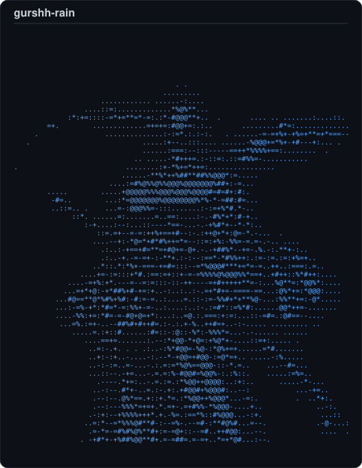

<table>
<tr>
<td valign="middle" width="50%">

Mechatronics Engineering student at the <b>University of Waterloo</b> (Tron '31). Building with passion in robotics, computer vision, AI/ML, LLM's, and the future of technology. 
I like making things that actually move, think, and work in the real world.

</td>
<td valign="middle" width="50%">

<picture>
  <source media="(prefers-color-scheme: dark)" srcset="dark_mode.svg" />
  <source media="(prefers-color-scheme: light)" srcset="light_mode.svg" />
  
</picture>

</td>
</tr>
</table>

## 🤖 What I Build

### Hardware & Robotics
- **Bionic Hand** — 3D-printed prosthetic hand controlled by real-time hand tracking via MediaPipe, mapping joint angles to servo positions for fluid, natural motion.
- **Quadpod Robot** — Four-legged walking robot with PID-controlled coordination across all legs simultaneously. Used ultrasonic sensor for object detection while walking.
- **ROS2 Fleet Robot Manager** - Automate multi robot workflows in a warehouse with an automated task queue sending to the nearest robot. 
- **ROS2 6-DOF Robotic Arm Simulation (YOLOv8) control** - Trained robotic arm in gazebo to detect objects using YOLOv8 and picks them up. *(still in progress)*
- **ROS2 Lidar Room Scanning Bot + Computer Vision Sensing (YOLO)** - LiDAR navigation system to scan room + detect objects through the COCO dataset. Generates 3D map of room.
### Controls & Systems
- **Automatic PID Tuner** — Uses gradient descent to automatically tune PID controller gains in MATLAB/Simulink, eliminating manual trial-and-error tuning.

### Computer Vision & ML
- **Turbofan RUL Prediction** — Predicts Remaining Useful Life of jet engines using the NASA C-MAPSS dataset, comparing Random Forest, XGBoost, LSTM, and an LSTM+XGBoost ensemble.
- **Predicting Neuro iEEG Data Comparing XGBoost And Transformer Architectures** — Transformer architecture for predicting iEEG data from neural signals. Comparing transformer performance to XGBoost. *(still need to add XGBoost)*
- **Framelyai — Behavioral Interview Analyzer** — Web platform analyzing eye contact, posture, expressions, and filler words in real time, with an LLM grading answers against the STAR framework.
- **Gesture-Controlled Computer** — Real-time hand tracking to click, scroll, and drag using only gestures, built with MediaPipe + PyAutoGUI.
- **Satellite Deforestation Detector** — Custom CNN classifying satellite imagery to detect deforestation, trained on the Amazon from Space dataset.
- **Brain Functional Connectivity During AI Assisted Essay Writing** - Brain Functional Connectivity During AI-Assisted Essay Writing An EEG surface-recording study analysing OpenNeuro ds008496 (Brain Connectivity Based on EEG of Student Learning Processes Using Gen-AI).
- **META Tribe V2 Interactive Brain Viewer With User Engagement Tracking** - Given a video, process all the video and sound to get a 3D view of neural activity in the brain through META's tribe v2 model. Signals video attention. 

### AI & Agents
- **RAG Portfolio Chatbot** — Ask anything about me, built from scratch with sentence-transformers, FAISS vector search, and a local LLM.
- **Linked Zip Bot** — Reinforcement learning agent trained to solve the Zip game. Trained on 5+ hours of consistent gameplay.
- **Zenai** - Terminal based agent (connect mcp's to control different apps).

### Research Papers *(soon to come)*
---

## 🛠 Skills

**Languages** &nbsp;`Python` `C++` `MATLAB` `Java` `HTML` `CSS` `Typescript`

**ML / AI** &nbsp;`PyTorch` `scikit-learn` `OpenCV` `MediaPipe` `Pandas` `NumPy` `Matplotlib` `Seaborn`

**Robotics** &nbsp;`ROS2` `PID Control` `Isaac Sim` `Servo/Motor Control` `Gazebo` `Nav2` `MoveIt2` `SLAM` 

**Other** &nbsp;`Fusion 360` `SOLIDWORKS` `Blender` `ANSYS` `MATLAB`

## 📫 Let's Connect

- 🔗 [LinkedIn](https://www.linkedin.com/in/gurshaan-gill-5b48603a4)
- 🌐 [Portfolio](https://gurshaangill.vercel.app)
- 📧 [gurshaan1124@gmail.com](mailto:gurshaan1124@gmail.com)

<i>Always building something. Always learning.</i>

