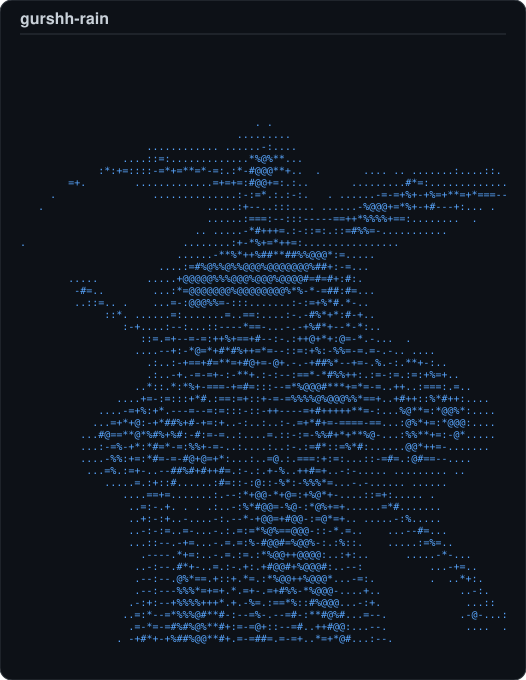

<table>
<tr>
<td valign="middle" width="50%">

Mechatronics Engineering student at the <b>University of Waterloo</b> (tron '31). Building with in physical ai, computer vision, AI/ML, agents, and the future of technology. 

</td>
<td valign="middle" width="50%">

<picture>
  <source media="(prefers-color-scheme: dark)" srcset="dark_mode.svg" />
  <source media="(prefers-color-scheme: light)" srcset="light_mode.svg" />
  
</picture>
</td>
</tr>
</table>

**Languages** &nbsp;`Python` `C++` `MATLAB` `Java` `HTML` `CSS` `Typescript`

**ML / AI** &nbsp;`PyTorch` `scikit-learn` `OpenCV` `MediaPipe` `Pandas` `NumPy` `Matplotlib` `Seaborn`

**Robotics** &nbsp;`ROS2` `PID Control` `Isaac Sim` `Servo/Motor Control` `Gazebo` `Nav2` `MoveIt2` `SLAM` `Mujoco` 

**Other** &nbsp;`Fusion 360` `SOLIDWORKS` `Blender` `ANSYS` `MATLAB`

